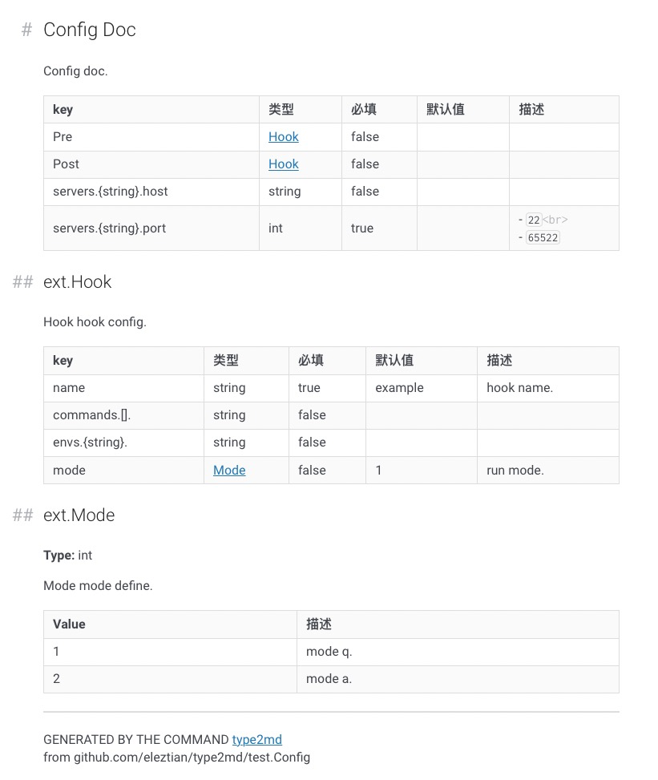

# golang type define to markdown 


## Usage

```go
package docs

//go:generate type2md github.com/eleztian/test Config

```

```shell
go install github.com/eleztian/type2md
go generate  ./...
```


